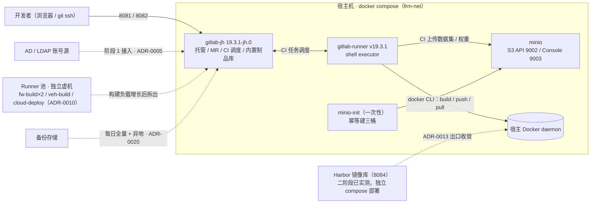

# 极狐 GitLab 实施与运维手册

- 状态：正式实施指南 v1（依据原型验证结论 2026-09-07 修订）
- 受众：阶段 1 正式实施本体系的平台运维——把已设计的方案从零建起来并日常运维。不要求复刻原型测试环境。
- 与其他文档的分工：为什么这么做、为什么不用别的 → `docs/design/` 与 `docs/adr/`；怎么照着做 → 本文；极狐与 CE 的差异坑位 → 原型验证结论 §3。
- 本文凡「示例值」（IP、端口、口令、组名、用户名）均来自原型验证环境，正式实施按实际替换。

## 1. 系统架构



实线=本次落地（与 `gitlab-compose-test/docker-compose.yml` 一一对照）；虚线=设计已定、按阶段推进的扩展位，编号即决策锚点。

**组件表（yml 评审的准绳）**：

| 组件 | 职责 | 镜像（钉版） | 宿主端口 | 数据卷 | 资源上限 |
|---|---|---|---|---|---|
| gitlab | 托管 / MR / CI 调度 / 内置制品库 | `gitlab-jh:19.3.1-jh.0` | 8081 web / 8082 ssh / 8083 registry（预留） | config / logs / data | 4C / 8G |
| gitlab-runner | shell executor 跑 CI，job 内可用 docker CLI | `gitlab-runner:v19.3.1` | — | runner-config | 2C / 2G |
| minio | 大文件对象存储（dataset-model / field-dropzone / training-output 三桶） | `minio:RELEASE.2025-09-07T16-13-09Z` | 9002 API / 9003 Console | minio-data | 1.5C / 2G |
| minio-init | 幂等建三桶，跑完即退，重跑无害 | `mc:RELEASE.2025-08-13T08-35-41Z` | — | — | 0.5C / 512M |

- 版本依据：均为原型实测在跑版本；runner 与 GitLab 主版本对齐（19.3.1），钉版纪律同 ADR-0021，离线机房预拉清单随之确定。
- 上限口径：设计 §7 生产主机 8C / 16G，四容器合计 8C / 12.5G，给 OS 与页缓存留余量。单机起步栈 runner 限 2G，重负载构建（固件交叉编译等）按设计 §7 拆独立 Runner 虚机，不在本栈内扛。
- **本表是准绳：改 yml 先对表；表要改先过设计文档。**

## 2. 部署准备

| 项 | 要求 | 说明 |
|---|---|---|
| 主机 | 8C / 16G / 200G SSD | 设计 §7；原型机 62G / 32C 富余放宽 |
| Docker + compose | 已装 | compose v2（`deploy.resources.limits` 依赖 v2） |
| 镜像预拉 | 4 个，共约 7.1G | gitlab-jh 6.21G / runner 489M / minio 241M / mc 117M，tag 见 §1 组件表；离线机房先在有网环境拉好再导入 |
| 端口占用 | 8081 / 8082 / 8083 / 9002 / 9003 | **示例值**：原型因测试机 8080 / 9000 / 9001 已被占而改此段；端口空闲的机器可改回默认，改了须同步改 compose 端口映射与 `external_url` |
| 凭据 | 原型口令内嵌 compose，正式实施另行管理 | `Excavator#2026Proto` 仅限原型栈；正式实施 root 口令走凭证通道注入，且首登立即改密（见 §4） |

## 3. 起栈与就绪

```bash
cd gitlab-compose-test
docker compose up -d
```

就绪判定（首次约 3–5 分钟）：

```bash
docker exec frm-gitlab gitlab-ctl status        # 各服务 run:
curl -sf http://127.0.0.1:8081/users/sign_in >/dev/null && echo ready
```

浏览器开 `http://<宿主IP>:8081`（示例值 `10.66.35.35`）。

### Runner 注册（起栈后必做，compose 只起容器不注册）

1. 管理区 → CI/Runners → New runner：命名（示例 `frm-shell-runner`），创建后复制 token。
2. 容器内注册——executor 选 **shell**：

   ```bash
   docker exec -it frm-runner gitlab-runner register \
     --url http://frm-gitlab:8081 --token <token> \
     --executor shell --name frm-shell-runner
   ```

3. **为什么是 shell 而非 docker executor**：shell + 挂宿主 `docker.sock`（二阶段设计 §3 实测口径），CI 里的 docker build / push / pull 即宿主 daemon 操作，Harbor 信任只需配宿主一处。compose 的 `group_add: "125"` 即为 runner 用户可访问 sock——**GID 以宿主实际为准**（`ls -l /var/run/docker.sock` 查属组，原型机为 125），换机不改会注册成功但 job 内 docker 报权限错。
4. 验证：管理区 runner 列表在线（绿点）；push 任一含 `.gitlab-ci.yml` 的提交，流水线跑通即闭环。

## 4. 首启初始化（一次性）

**原则：omnibus 键首启 seed 生效；实例一旦运行过，改设置须直改数据库**（`gitlab-rails runner` 改 `current_application_settings`），改 compose 环境变量不再生效。本节动作都在首启后尽快做完。

1. **root 首登改密**：用 compose 内嵌口令登录，立即改密。
2. **核对注册已关**：compose 默认 `gitlab_signup_enabled=false` 与 `can_create_group=false`，首启 seed 即生效，正常无需动作；登录页无「注册」入口即为生效。若实例已运行过再想关，须 DB 直改（同下条方式）。
3. **关 Web IDE 单一源回退**（消除管理区一条高严重性安全警告）：扩展主机域是外网 CDN，机房构建区不通外网，回退开启时实例会从自身同源提供 VSCode 资源、危及会话凭证。本环境扩展市场已关，直接关掉无功能损失：

   ```bash
   docker exec frm-gitlab gitlab-rails runner '
   s=Gitlab::CurrentSettings.current_application_settings
   m=s.vscode_extension_marketplace; m["single_origin_fallback_enabled"]=false
   s.update!(vscode_extension_marketplace: m)'
   ```

> 为什么关注册？账号一律管理员开通（见 §6.1），契合设计 §3「平台组统一开通」口径，也为阶段 1 接 LDAP 时账号名对齐留干净底子。`can_create_group` 同关，防止用户乱建顶层组。
>
> LDAP 域账号对接是阶段 1 正式实施项，现阶段用本地账号。上线前管理员按 AD 用户名建号，LDAP 接通后同名域账号首登即复用，切换干净（ADR-0005）。

## 5. 按设计建立组织结构

本章教**通用做法**——组树、仓库、角色是设计产出，各项目按自己的产品域落地；原型环境的具体取值（组名、用户、MR 编号）只是示例，见附录 A。

### 5.1 组树（ADR-0003）

顶层组=项目，子组=产品域（团队会重组、产品域相对稳定）：`firmware / autonomy / vehicle / cloud / app / platform`，子组内按组件建仓库。`platform/` 是宪法组：CI 模板与规范文档全部版本化，规则修改必须走 MR，不允许口头变更。

- UI：新建组 → 填路径与可见性（内部）；或 API `POST /api/v4/groups`（管理员 token），批量建组树好用。

### 5.2 用户与权限（ADR-0004 / 0005）

关注册后账号只有一个入口：管理员开通（做法见 §6.1）。建号后按三级授权：

| 角色 | 权限 | 授予对象 |
|---|---|---|
| Guest / Reporter | 只读 | 跨组查阅者、外部协作者 |
| Developer | push 分支、建 MR | 本组开发成员 |
| Maintainer | 合 MR、管保护分支 | 每仓库 1–2 名 Owner |

顶层组 Owner 由项目负责人持有（兼平台维护人）。免费版无审计能力，成员变更一律经 API 并留存脚本日志（唯一留痕）。

### 5.3 仓库与保护分支（ADR-0006）

子组内建仓（`firmware/hydraulic-controller` 一类），每仓指定一名明确 Owner。分支 trunk-based 简化版：`main` 常绿 + 短命特性分支 + MR 合入；保护分支禁直接 push；发布周期长的仓库可留 `release/x.y` 维护分支。存量代码入库门槛：能编译、README 写明用途 / Owner / 依赖——**用途说不清的代码不入库**。

### 5.4 CI 三层模板（ADR-0009）

1. 建 `platform/ci-templates` 宪法仓库，写通用层模板（固件 / 算法 / 车载 / 云端各一套，内容按项目自写）。模板建立与修订走 MR——规则变更即宪法变更。
2. 各仓库 `.gitlab-ci.yml` 以 `include: project:` 引用通用层，仓库层只覆盖细节。**未 include 通用层的流水线 MR 不予合入**：检查 job 校验 + Maintainer 人工拒合，双重实现。
3. 下游层（固件签名、模型评测）为正式实施项，密钥走受保护变量、流水线不接触明文（ADR-0012）。

### 5.5 需求流与看板（ADR-0015–0017）

- 建收口仓库（示例名 `intake`）承接需求与现场问题进池，标签体系分诊、里程碑归组，跨仓单据转移走 GitLab 原生 transfer。
- 组看板配状态列（设计为六状态）。**坑位**：组看板懒创建，配置前须先浏览器访问过看板页（验证结论 §3）。

## 6. 日常运维

### 6.1 开账号（关注册后的唯一入口）

正式环境配 SMTP 后可发重置链接；未配 SMTP（原型如此）则账号由管理员显式建：

- **界面**：管理区 → 用户 → 新建用户，填姓名 / 用户名（对齐 AD）/ 邮箱，设初始密码。
- **API**：`POST /api/v4/users`（管理员 token），可脚本批量建号，对上线波峰好用。

初始密码线下交付（口述 / 凭证通道），要求首登改密。权限另算——建号后由仓库 Owner 加组加角色（CE 无分组同步，见 ADR-0005 边界表），账号 ≠ 权限。

### 6.2 封禁与离职回收

GitLab 不自动清离职者存量访问（SSH key / 令牌 / 会话）。阶段 1 实施定时脚本比对 AD 禁用名单 → 调 API 封禁账号（ADR-0005）。原型验证即以此模式操作（验证结论 §3 实测#12）。

### 6.3 备份与恢复

GitLab 原生全量备份每日，含配置 + 仓库 + 数据库，保留异地 / 离线副本；恢复演练每半年一次（ADR-0020）。MinIO 数据按资产备份（数据集 / 权重 / 现场采集不可再生）。**未演练过的备份等于没有备份。**

## 附录 A：原型复现（测试 fixture）

定位：`rebuild_jh_state.py` 是**原型验证的测试夹具**，用于复刻原型终态（演示、回归、重拍证据用），**不是正式实施路径**——它建出的组树 / 用户 / 仓库 / MR 全部是原型测试数据（`intel_excavator` 组树、`dev1` 等账号、模拟 MR）。正式实施按 §5 逐项自建。

前置条件：栈已就绪；root 建 PAT（脚本内 `ROOT_TOK` 处替换）；`/tmp/harbor-robot-secret.txt` 存在（E 段 HARBOR 变量依赖，缺失即崩）。

```bash
cd gitlab-compose-test
python3 rebuild_jh_state.py A|B|...|Z
```

| 段 | 做什么 |
|---|---|
| A | 用户 + 组树（顶层 intel_excavator + 六子组）+ platform 成员 + ci-templates 含宪法 MR !1/!2 |
| B | firmware 项目 + 成员 + 保护分支 + CI v1 |
| C | firmware MR !1/!2 + tag v0.2.0-field + Release |
| D | firmware MR !3/!4 |
| E | HARBOR_* 组变量 + CI 演进到终版 + MR 模板 |
| F | firmware MR !5（液压抖动）+ tag v0.9.0-rc1 + Release |
| G | perception 仓库 + MINIO_* 变量 + 流水线 |
| H | intake + 11 标签 + 里程碑 + 四单分诊 |
| I | 组看板六状态列（需先浏览器访问过看板页） |
| J | 全员中文 + 吊销模拟 PAT + 终态核对 |
| Z | 吊销模拟 PAT（收尾单独跑） |

进度落盘 `/tmp/jh-rebuild-state.json`，可断点续跑。API 调用已按验证结论 §3 的坑位规避（`/repository/files` 恒 404 一律走 Commits API、merge 必带 sha 等）。

**证据与留档**：实例终态镜像 `gitlab-compose-test/*-repo/`；验证截图 01–43 `gitlab-compose-test/screenshots/`；验证结论 `docs/design/2026-09-07-prototype-verification.md` §5。

## 附录 B：已知坑位（不抄，指向验证结论）

极狐与 CE 的七处 API / 路由差异、组看板懒创建、`/repository/files` 恒 404 等规避方式，见 `docs/design/2026-09-07-prototype-verification.md` §3 差异表。凡脚本化操作（含 §5 的 API 批量建组树）先过一遍该表。
